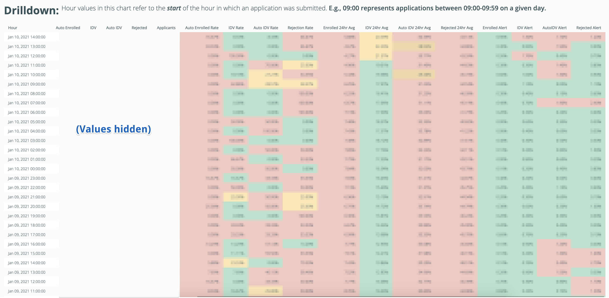

# Onboarding Outcome Variance Tracking
Applications for new bank accounts are approved using business rules based on the output of a third-party identity verification model. Customer information supplied in the application form is used as an input, and the model returns risk information, including the probability that the credentials are stolen or synthetic. 

In order to warn of changes in applicant quality or potential fraud attacks, this query tracks changes in the distribution of application outcomes. Sudden spikes in rejection rates or decreases in approval rates may indicate suspicious activity (e.g., botnets submitting applications with stolen or synthetic credentials).

This query returns hourly values for the number and percentage of applications which are approved, rejected, or sent to manual review. Additionally, it calculates the standard deviation of approval/rejection/review rates within the preceding 24 hours. These results are used to trigger alerts if actual values move outside of acceptable boundaries, or if standard deviation spikes.

```sql
SELECT 
  applied_hour,
  Enrolled_variance_sqrt,
  Rejected_variance_sqrt,
  IDV_variance_sqrt,
  Auto_variance_sqrt,
  CASE    
    WHEN (Enrolled_variance_sqrt  >= 1.2 AND Rejected_variance_sqrt  >= 1.2) 
      OR (Enrolled_variance_sqrt  >= 1.2 AND IDV_variance_sqrt       >= 1.2)
      OR (Enrolled_variance_sqrt  >= 1.2 AND IDV_variance_sqrt       >= 1.2)
      OR (Enrolled_variance_sqrt  >= 1.2 AND Auto_variance_sqrt      >= 1.2)
      OR (Rejected_variance_sqrt  >= 1.2 AND IDV_variance_sqrt       >= 1.2) 
      OR (Rejected_variance_sqrt  >= 1.2 AND Auto_variance_sqrt      >= 1.2) 
      OR (IDV_variance_sqrt       >= 1.2 AND Auto_variance_sqrt      >= 1.2) 
    THEN 'Multiple Onboarding metrics'
    WHEN Enrolled_variance_sqrt  >= 1.2 THEN 'Enrolled Rate' 
    WHEN Rejected_variance_sqrt  >= 1.2 THEN 'Rejection Rate' 
    WHEN IDV_variance_sqrt       >= 1.2 THEN 'IDV Rate' 
    WHEN Auto_variance_sqrt      >= 1.2 THEN 'Auto IDV Rate'
  ELSE NULL
  END as alert_value
FROM (
SELECT
  applied_hour,
  100*ROUND(SQRT(VARIANCE("Enrolled Rate 24hr Average") OVER(ORDER BY applied_hour ASC ROWS 1 PRECEDING)),3) as Enrolled_variance_sqrt,
  100*ROUND(SQRT(VARIANCE("IDV 24hr Average") OVER(ORDER BY applied_hour ASC ROWS 1 PRECEDING)),3) as IDV_variance_sqrt,
  100*ROUND(SQRT(VARIANCE("Auto IDV 24hr Average") OVER(ORDER BY applied_hour ASC ROWS 1 PRECEDING)),3) as Auto_variance_sqrt,
  100*ROUND(SQRT(VARIANCE("Rejected 24hr Average") OVER(ORDER BY applied_hour ASC ROWS 1 PRECEDING)),3) as Rejected_variance_sqrt
FROM (
  SELECT 
    *, 
    SUM(auto_enrolled::float) OVER(ORDER BY applied_hour ASC ROWS 23 PRECEDING)/SUM(applicants) OVER(ORDER BY applied_hour ROWS 23 PRECEDING) as "Enrolled Rate 24hr Average",
    SUM(hit_idv::float) OVER(ORDER BY applied_hour ASC ROWS 23 PRECEDING)/SUM(applicants) OVER(ORDER BY applied_hour ROWS 23 PRECEDING) as "IDV 24hr Average",
    SUM(hit_auto_idv::float) OVER(ORDER BY applied_hour ASC ROWS 23 PRECEDING)/SUM(applicants) OVER(ORDER BY applied_hour ROWS 23 PRECEDING) as "Auto IDV 24hr Average",
    SUM(auto_rejected::float) OVER(ORDER BY applied_hour ASC ROWS 23 PRECEDING)/SUM(applicants) OVER(ORDER BY applied_hour ROWS 23 PRECEDING) as "Rejected 24hr Average"
  FROM (
    SELECT 
      date_trunc('hour', convert_timezone('america/los_angeles', audited_at)) as applied_hour,
      COUNT(DISTINCT CASE WHEN sippy_status = 'ACTIVE' THEN customer_reference END) as auto_enrolled,
      COUNT(DISTINCT CASE WHEN sippy_status = 'IDV' THEN customer_reference END) as hit_idv,
      COUNT(DISTINCT CASE WHEN sippy_status = 'AUTO_IDV' THEN customer_reference END) as hit_auto_idv,
      COUNT(DISTINCT CASE WHEN sippy_status = 'REJECTED' THEN customer_reference END) as auto_rejected,
      COUNT(DISTINCT customer_reference) as applicants
    FROM (
      SELECT 
        customer_reference,
        audited_at,
        sippy_status,
        RANK() OVER(PARTITION BY customer_reference ORDER BY audited_at ASC) as n
      FROM analytics.realtime_application_outcome_table)
    WHERE audited_at > '2019-10-31' -- Note: Adjust this cutoff as needed.
      AND audited_at < date_trunc('hour', getdate())
      AND n = 1
    GROUP BY 1))
ORDER BY 1 DESC)
LIMIT 100
;
```
### Example output:

